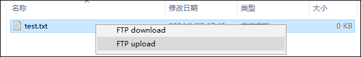
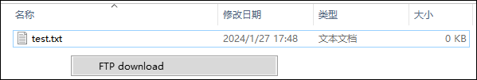

# ftp_sftp
使用FTP/SFTP协议简化文件传输

## 说明
该工具用于简化两个网络环境(一般是内网和外网)之间使用FTP/SFTP协议进行文件传输

## 使用
#### 支持以下2种操作模式：
1. 外网上传文件 -> 内网下载文件  
外网机器操作步骤：选择文件/目录右键菜单，左键点击"FTP upload"，将文件上传到服务器  
  
内网机器操作步骤：目录空白处右键菜单，左键点击"FTP download"，将文件下载到本地  

2. 内网上传文件 -> 外网下载文件  
内网机器操作步骤：选择文件/目录右键菜单，左键点击"FTP upload"，将文件上传到服务器  
  
外网机器操作步骤：目录空白处右键菜单，左键点击"FTP download"，将文件下载到本地  

## 配置
    {
        "comment":"外网FTP/SFTP服务器地址",
        "outer_host":"192.168.0.1",
        "comment":"内网FTP/SFTP服务器地址",
        "inner_host":"192.168.0.2",
        "comment":"服务器端口，22表示使用SFTP协议，21表示使用FTP协议",
        "port":22,
        "comment":"用户名",
        "username":"",
        "comment":"密码",
        "password":"",
        "comment":"外网服务器文件路径",
        "outer_path":"/Outer",
        "comment":"内网服务器文件路径",
        "inner_path":"/Inner"
    }

## 安装
1. 生成安装文件  
执行package.bat脚本  
生成ftp_download.exe、ftp_upload.exe、register_inner_menu.exe和register_outer_menu.exe  
2. 外网主机注册  
执行register_outer_menu.exe文件，注册到系统右键菜单  
3. 内网主机注册  
执行register_inner_menu.exe文件，注册到系统右键菜单  

## 其他
#### 优化存储空间
1. 对于zip文件、7z文件、tar文件和gz文件，不进行压缩上传到服务器  
2. 对于目录和其他格式文件，先使用Zip压缩然后上传到服务器  
